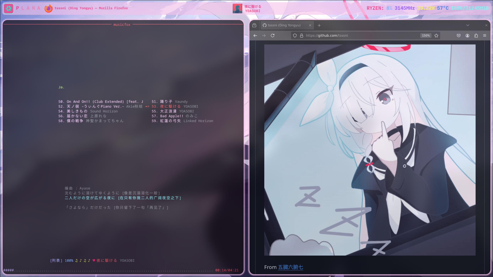

# tsssni.nix




## Intro

- Modules & Functions & Packages shared via flake outputs
- Framework for building system configs used on tssssni's NixOS PC & Nix-Darwin Macbook Air
- Nixvim with friendly shortcuts and powerful plugins

## Usage

### flake
Put tsssni.nix in your flake inputs. Only support unstable now, 24.11 release in on the way.
```nix
inputs = {
  nixpkgs.url = "github:NixOS/nixpkgs/nixos-unstable";
  tsssni = {
    url = "github:tsssni/tsssni.nix";
    inputs.nixpkgs.follows = "nixpkgs";
  };
};
```

### modules

Provide modules in `tsssni.${platform}Modules.tsssni`. You include them in corresponiding options.
```nix
nixosConfigurations.tsssni = nixpkgs.lib.nixosSystem {
  modules = [ tsssni.nixosModules.tsssni ];
};
darwinConfigurations.tsssni = nix-darwin.lib.darwinSystem {
  modules = [ tsssni.darwinModules.tsssni ];
};
{
  home-manager.users.tsssni = { ... }: {
    imports = [ tsssni.homeManagerModules.tsssni ];
  };
}
```

### lib
Provide lib with `tsssni.lib`. You could include it in module special args.
```nix
specialArgs = { tsssni.lib = tsssni.lib; };
```

### pkgs
Provide pkgs with `tsssni.pkg`. You could call it with desired args and include it in module special args.
```nix
specialArgs = { tsssni.pkgs = tsssni.pkgs {
  localSystem = "aarch64-darwin";
  crossSystem = "aarch64-embedded";
  config.allowUnfree = true;
};
```

## Config

You can put your configs under `./configs/(nixos|nix-darwin)/${your-host-name}`, then write nixos/nix-darwin configs under `system/` and home-manager configs under `home/` (should have `default.nix` under the directory), then run `(nixos|darwin)-rebuild switch --flake .` to build your system.

Your `default.nix` should follow this format. `system` is required since I could not detect it, and you could add `extra*` configs.
```nix
{
  inputs
, tsssni
, host
}:
import ../rebuild.nix {
  inherit inputs tsssni host;
  system = "x86_64-linux";
  extraSystemModules = [];
  extraHomeManagerModules = with inputs; [
    nixvim.homeManagerModules.nixvim
    ags.homeManagerModules.ags
  ];
  extraSpecialArgs = {};
}
```

